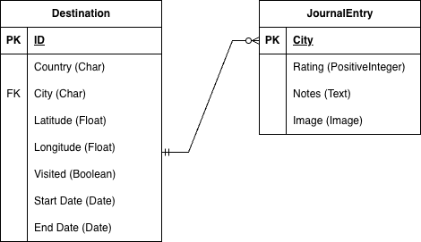

# Passport

My final project is Passport, a Django web application designed to track travel history and future itinerary planning. The application will center on two primary models: Destination (containing city/country, coordinates, and target visit dates) and JournalEntry (linked to a specific Destination, containing notes, ratings, and images). The dashboard will feature an interactive Leaflet.js map displaying pins for all visited and planned locations, alongside a summary widget of total countries visited. Users can submit new trips via a standard Django form, manage locations via the admin interface, and export their travel history to a CSV file.

## Where to Find Each Requirement

### Dashboard
- **URL:** `/`
- **View:** `travellog/views.py → home`
- **Template:** `travellog/templates/home.html`
- **Features:** Map, trip table, and summary stats (total trips, countries, upcoming).

### Interactive Map
- **Library:** Leaflet.js  
- **Map Container:** `

` in `home.html`
- **JavaScript:** `travellog/static/script.js`
- **Data Source:** `destinations` passed from Django into JS.

### Add Trip (Modal Form)
- **Button:** “Add a Trip” on dashboard
- **Form:** `travellog/forms.py → DestinationForm`
- **Backend Handler:** `travellog/views.py → home`
- **Behavior:** Opens as modal, submits via POST, saves destination, redirects to avoid resubmission.

### Automatic Latitude & Longitude (API)
- **Helper Function:** `travellog/views.py → get_lat_lng(city, country)`
- **Used In:** `travellog/views.py → home` during form save
- **Purpose:** Converts user-entered city & country into coordinates for the map.

### Data Export Utility (XLSX)
- **URL:** `/export/xlsx/`
- **Button:** "Export to Excel" at bottom of right panel on dashboard
- **View:** `travellog/views.py → export_to_xlsx`
- **Library Used:** `pandas.to_excel()`
- **Output File:** `passport_trips.xlsx`

### Database & Admin
- **Model:** `travellog/models.py → Destination and JournalEntry`
- **Admin Panel:** `/admin/`

## ERD
